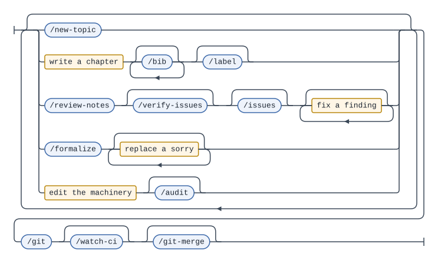

# 数学勉強ノート

[English](./README.md) | 日本語

このレポの目的は数学のノート作りを軸として, LaTeX, Lean, Git, Claudeやワークフローの構造などを実際に手を動かして学ぶことです。
ノート作りの過程で必要に応じて新しい機能の追加や既存のシステムの修正を行います。

各トピックのPDFは以下から閲覧できます。

<!-- BEGIN PDF LINKS -->
* [代数的K理論](./pdf/algebraic_k_theory.pdf)
* [圏論](./pdf/category_theory.pdf)
* [可換環論](./pdf/commutative_ring_theory.pdf)
* [微分幾何学](./pdf/differential_geometry.pdf)
* [ガロア理論](./pdf/galois_theory.pdf)
* [ホモロジー代数](./pdf/homological_algebra.pdf)
* [λ計算](./pdf/lambda_calculus.pdf)
* [多様体論](./pdf/manifold.pdf)
* [シンプレクティック多様体](./pdf/symplectic_manifold.pdf)
* [位相幾何学](./pdf/topology.pdf)
<!-- END PDF LINKS -->

各トピックに書かれた文章量の割合です。
章のソース `tex/*/ch*.tex` の文字数で, コメント行は数えていません。

<!-- BEGIN TEXT METER -->
```
category_theory          ██████████▌░░░░░░░░░   52.6%   61,312
homological_algebra      ███▍░░░░░░░░░░░░░░░░   16.7%   19,516
algebraic_k_theory       ███░░░░░░░░░░░░░░░░░   15.2%   17,748
lambda_calculus          █▊░░░░░░░░░░░░░░░░░░    8.7%   10,191
commutative_ring_theory  █▏░░░░░░░░░░░░░░░░░░    5.4%    6,325
topology                 ▏░░░░░░░░░░░░░░░░░░░    0.6%      691
manifold                 ▏░░░░░░░░░░░░░░░░░░░    0.5%      572
galois_theory            ▏░░░░░░░░░░░░░░░░░░░    0.3%      313
differential_geometry    ░░░░░░░░░░░░░░░░░░░░    0.0%        0
symplectic_manifold      ░░░░░░░░░░░░░░░░░░░░    0.0%        0
                                                       -------
total                                                  116,668
```
<!-- END TEXT METER -->

## 必要なもの

このレポにはロックファイルがないので, 必要なものはこの表がすべてです。

| 必要なもの | 用途 | 備考 |
| --- | --- | --- |
| LuaLaTeX と `latexmk` を含む TeX Live | PDF のビルド | `.latexmkrc` が `$pdf_mode = 4` を設定しているので, LuaLaTeX が DVI を経由せずに PDF を書き出します |
| Python 3 | `scripts/` | 標準ライブラリのみです。`requirements.txt` はなく, インストールするものはありません |
| [`elan`](https://github.com/leanprover/elan) | `lean/` | `lean/lean-toolchain` を読み, 固定された `leanprover/lean4:v4.32.2` を自分で取得します |
| 認証済みの [`gh`](https://cli.github.com/) | `/review-notes`, `/verify-issues`, `/issues`, `/tutor`, `/formalize`, `/git`, `/git-merge`, `/delete-topic`, `/watch-ci` | 指摘は GitHub の issue として管理します。ローカルの `issues/` ワークリストは gitignore されています |

最初に `cd lean && lake build` を実行する前に `cd lean && lake exe cache get` を実行してください。
Mathlib を `master` ではなくリリースタグに固定しているのは, ビルド済みキャッシュが必ず当たるようにするためです。
キャッシュがないと Mathlib をソースからコンパイルすることになり, 数秒で済むところが数時間かかります。

## 作業ループ

このレポでの一回の作業を文法として表したものです。
青い箱はスラッシュコマンド, 黄色い箱はどのコマンドも代わりにやってくれない部分で, 実際に時間がかかるのはそこです。



読み方は「任意の作業を任意の順序で好きなだけ行い, 最後に取り込む」です。
章は一度で書き終わることがほとんどなく, 書く・レビューする・直す・また書くを繰り返すので, ループになっています。
CI は何かが push されるまで動かないので, 出口は `/git` だけです。

文法の定義は `docs/working-loop.ebnf` で, [syntax-diagram-generator](https://github.com/ys-math/syntax-diagram-generator) で描画しています。
文法を編集したら描画し直して, 両方をコミットしてください。
存在しないコマンドを文法が名指ししていると `scripts/test_agent_docs.py` が失敗します。

図にはあえて載せていないコマンドが二つあります。
`/delete-topic` は手順ではなく出口であり, `/tutor` は手順ではなく割り込みだからです。
`/delete-topic` は自分でコミットと push を行う唯一のコマンドでもあります。

## コマンド
すべてレポのルートから実行してください。

| コマンド | 内容 |
| --- | --- |
| `python scripts/new_topic.py <topic> --title <title>` | `tex/<topic>/` を作り, `main.tex` と, CC BY-NC-ND の SPDX ヘッダだけを持つ `ch01.tex` を置きます。スラッグの形式は `docs/naming-convention.md` にあり, スクリプトがそれを強制します。タイトルは `\DocTitle` になり, 上の PDF 一覧のリンク名になります |
| `latexmk -cd -g tex/<topic>/main.tex` | トピックの PDF をローカルでコンパイルします。`-cd` でトピックのディレクトリに入るので `\input{../preamble.tex}` が解決され, `-g` で latexmk のキャッシュを無視して再ビルドします。`docs/git-strategy.md` の `## Gates` を参照してください |
| `cd lean && lake build` | `lean/` の Lean ライブラリをビルドします。キャッシュが温まっていれば約3秒です。`sorry` は許されており, ビルドは失敗しません。`lake --dir=lean` ではなく `cd` を使ってください。elan はツールチェーンを作業ディレクトリから読むので, レポのルートからだと気づかないうちに違う Lean を使います。`docs/git-strategy.md` の `## Gates` を参照してください |
| `python -m unittest discover -s scripts -t scripts -p 'test_*.py'` | `scripts/` のテストです。`scripts/` に何かをコミットする前に実行してください |
| `python scripts/check_bibliography.py [<topic>]` | `tex/*/bibliography.tex` を `docs/bib-convention.md` に照らして検査します。SPDX ヘッダ, キーの形, 三行の文法, タイトルのマークアップ, 並び順, ラベル幅を見ます。構造だけを見るので, 年や出版社が正しいかどうかは分かりません |
| `python scripts/generate_pdf_links.py`<br>`python scripts/generate_tree.py`<br>`python scripts/generate_text_meter.py` | 両方の README の生成ブロックを書き直します。普段は CI が行うので, 手で実行することはまずありません |

Claude Code のスラッシュコマンド:

| コマンド | 内容 |
| --- | --- |
| `/new-topic <topic> <title>` | 上の `new_topic.py` を実行してトピックを作ります |
| `/delete-topic <topic>` | トピックを削除します。`tex/<topic>/`, `pdf/<topic>.pdf`, Lean のミラーとその `import`, 未解決のレビュー issue, ローカルの生成物を消し, 削除をコミットして push します。名前の変更は今も手作業です |
| `/label [topic ...]` | トピックの定理環境に `docs/label-convention.md` に従った `\label{}` 名を提案し, 選んだものを適用します |
| `/bib <topic> <citation>` | 与えた文献を `docs/bib-convention.md` に従って `tex/<topic>/bibliography.tex` に登録します。トピックにまだそのファイルがなければ作成し, `main.tex` の colophon の前で `\input` します。`\cite{}` は挿入しません。引用するのはあなたで, 引用する文もあなたが書きます |
| `/formalize <topic> [label ...]` | トピックのラベル付き定理を, `sorry` で証明された Lean の命題として `lean/Math/Study/<Topic>.lean` に写します。ラベル本体をそのまま宣言名に使います。証明は決して書きません |
| `/tutor <question>` | 数学, LaTeX, Lean についての質問に, 質問が指している箇所に基づいて答えます。まず該当箇所を見つけてどこを読んでいるかを示し, 確認の質問は二つまでにして, それから完全に答えます。書き込みはできません (`disallowed-tools` が `Write` と `Edit` を外しています)。修正はすべてあなたが打ち込みます |
| `/review-notes [topic ...]` | トピックのノートを数学的な正しさ, 誤字, LaTeX の健全性の観点でレビューし, 選んだ指摘を `docs/issue-convention.md` に従って GitHub の issue にします。既存の未解決 issue が扱っているものは飛ばし, 何も閉じません |
| `/issues [topic ...]` | トピックの未解決レビュー issue を `issues/<topic>.md` に書き出します (gitignore 済みで, 実行のたびに上書きされます)。リンクを開くと作業コピーの該当行に飛びます |
| `/verify-issues [topic \| #N ...]` | トピックの未解決レビュー issue が本当に正しいかを, issue 自身の推論より先にソースを読み直して確かめます。正しくないものは `--reason "not planned"` で, 反証となる行をコメントに付けて閉じます。実在する欠陥を誤って記述している本文は直し, それ以外には手を付けません |
| `/audit [file ...]` | 同じことを数学ではなく仕組みに対して行います。コマンド, 指示ファイル, フックに矛盾, 古くなった記述, 死んだ手順がないかを調べ, `.claude/audits/audit.md` に書き出します (gitignore 済みで, 実行のたびに上書きされます)。そのうえで指定した修正だけを適用し, コミットは `/git` に任せます |
| `/git [description]` | `docs/git-strategy.md` に従って同期, コミット, push を行います |
| `/git-merge [PR number]` | プルリクエストのゲートを再実行し, スカッシュマージ (squash merge) します |
| `/watch-ci [sha]` | コミットの CI の状況を報告して止まります。`/loop` の下で動かすためのものです |

`docs/agent-system.md` に全体の地図があります。
これらのコマンド, 指示ファイル, レポのルールを強制するフック, CI の連鎖がどう止まるかが載っています。

章を追加するときは `ch02.tex` を作り, そのトピックの `main.tex` に `\input{ch02.tex}` を手で書き足してください。
自動では行われません。
ついでに `ch01.tex` から `% SPDX-License-Identifier: CC-BY-NC-ND-4.0` の行をコピーしてください。
これが自動で付くのは生成された `ch01.tex` だけです。

Lean のファイルを追加するときは `lean/Math/` の下に作り, 同じコミットで `lean/Math.lean` にその `import` を書き足してください。
これも自動では行われず, どこからも import されていないモジュールは `lake build` から見えません。
1行目には Apache のヘッダが必要で, その文面は `docs/lean-convention.md` にあります。

`main` に push すると CI が引き継ぎます。
`build-pdf.yml` が `pdf/<topic>.pdf` をコミットし, `update-readme.yml` が PDF 一覧, 文章量メーター, 下のディレクトリツリーをこのファイルと `README.md` の両方で再生成し, `lean/` に触れていれば `lean.yml` がそれをビルドします。
これらの一覧は生成物なので, 直すのは `.tex` のソースです。
一覧のまわりの文章は生成物ではありません。
二つの README は互いの翻訳なので, 一方を変えたら同じコミットでもう一方も変えてください。
ツリーは `lean/Math/` をすべて載せるので, `Learn/MIL/` や `Learn/TPiL/` の下に新しい章を置けばツリーに現れます。

## ディレクトリ構成
<!-- BEGIN TREE -->
```
math-study/
├── docs/
│   ├── images/
│   │   ├── audit-workflow.svg
│   │   ├── routing-rule.svg
│   │   └── working-loop.svg
│   ├── agent-system.md
│   ├── audit-workflow.ebnf
│   ├── bib-convention.md
│   ├── git-strategy.md
│   ├── index-convention.md
│   ├── issue-convention.md
│   ├── label-convention.md
│   ├── lean-convention.md
│   ├── naming-convention.md
│   ├── repo-structure.md
│   ├── routing-rule.ebnf
│   └── working-loop.ebnf
├── lean/
│   ├── Math/
│   │   ├── Learn/
│   │   │   ├── MIL/
│   │   │   │   └── C02Basics.lean
│   │   │   └── TPiL/
│   │   │       ├── C02DependentTypeTheory.lean
│   │   │       ├── C03PropositionsAndProofs.lean
│   │   │       ├── C04QuantifiersAndEquality.lean
│   │   │       ├── C05Tactics.lean
│   │   │       ├── C06InteractingWithLean.lean
│   │   │       └── C07InductiveTypes.lean
│   │   └── Study/
│   │       └── CategoryTheory/
│   │           └── C01.lean
│   ├── Math.lean
│   ├── lake-manifest.json
│   ├── lakefile.toml
│   └── lean-toolchain
├── scripts/
│   ├── check_bibliography.py
│   ├── generate_pdf_links.py
│   ├── generate_text_meter.py
│   ├── generate_tree.py
│   ├── latex_unicode.py
│   ├── new_topic.py
│   ├── readme_block.py
│   ├── test_agent_docs.py
│   ├── test_assumes.py
│   ├── test_check_bibliography.py
│   ├── test_generate_text_meter.py
│   ├── test_generate_tree.py
│   ├── test_index_markup.py
│   ├── test_latex_unicode.py
│   ├── test_new_topic.py
│   └── test_readme_block.py
├── tex/
│   ├── algebraic_k_theory/
│   │   ├── bibliography.tex
│   │   ├── ch01.tex
│   │   └── main.tex
│   ├── category_theory/
│   │   ├── bibliography.tex
│   │   ├── ch01.tex
│   │   ├── ch02.tex
│   │   ├── ch03.tex
│   │   ├── ch04.tex
│   │   ├── ch05.tex
│   │   ├── ch06.tex
│   │   ├── ch07.tex
│   │   ├── ch08.tex
│   │   └── main.tex
│   ├── commutative_ring_theory/
│   │   ├── bibliography.tex
│   │   ├── ch01.tex
│   │   └── main.tex
│   ├── differential_geometry/
│   │   ├── ch01.tex
│   │   └── main.tex
│   ├── galois_theory/
│   │   ├── ch01.tex
│   │   └── main.tex
│   ├── homological_algebra/
│   │   ├── ch01.tex
│   │   ├── ch02.tex
│   │   ├── chA.tex
│   │   └── main.tex
│   ├── lambda_calculus/
│   │   ├── ch01.tex
│   │   ├── ch02.tex
│   │   ├── ch03.tex
│   │   └── main.tex
│   ├── manifold/
│   │   ├── ch01.tex
│   │   └── main.tex
│   ├── symplectic_manifold/
│   │   ├── ch01.tex
│   │   └── main.tex
│   ├── topology/
│   │   ├── ch01.tex
│   │   └── main.tex
│   ├── colophon.tex
│   ├── index.ist
│   └── preamble.tex
├── CLAUDE.md
├── LICENSE
├── LICENSE-APACHE-2.0
├── LICENSE-CC-BY-NC-ND-4.0
├── README.ja.md
└── README.md
```
<!-- END TREE -->

## AI の利用

このレポは [Claude Code](https://claude.com/claude-code) を使って書かれており, Claude が書くものと著者が書くものの境界は意図して引かれています。

- **数学は著者のものです。**
  `tex/*/ch*.tex` の文章, つまり PDF に載っている定義, 定理, 証明, 例はすべて著者が書いています。
  Claude はそれを書くことも書き直すこともしません。
  `/review-notes` はノートを読んで見つけたことを GitHub の issue にするだけで, どれをどう直すかは著者が決めます。
- **Lean の証明も著者のものです。**
  `/formalize` はラベル付きの命題を `sorry` を証明として `lean/Math/Study/` に写すことがありますが, `by` より後ろはすべて著者のもので, `lean/Math/Learn/` は丸ごと著者のものです。
  前者は `lean/Math/Study/` の下で `guard-edits.sh` が強制しています。
- **ツール類はおもに Claude のものです。**
  `scripts/`, `.github/`, `docs/`, `.claude/`, 両方の README, 共有の `tex/preamble.tex`, `tex/colophon.tex`, `tex/index.ist` は大部分を Claude が書いています。
- **どちらが書いたかは `git log` でコミット単位で分かります。**
  Claude の作業を含むコミットには `Co-Authored-By: Claude` のトレーラーが付きます。
  プルリクエストはスカッシュマージで一つのコミットにまとめられ, 一部にでもトレーラーがあればまとめたコミットにも付きます。
  章のファイルに触れるコミットのうち四つにトレーラーが付いていますが, どれも数学を書いたものではありません。
  `d47c1ab` はすべてのソースを `tex/` の下に移し, `446572b` はビルドを LuaLaTeX と jlreq に切り替え, `eada0b3` は索引用の `\term` マークアップを加えたもので, `1b34b3a` (#55) は章の文章がトレーラーのないコミットから来たスカッシュです。

この背後にあるルールは, Claude が最初に読む `CLAUDE.md` にあります。

## ライセンス
[![MIT][mit-shield]][mit] [![CC BY-NC-ND 4.0][cc-by-nc-nd-shield]][cc-by-nc-nd] [![Apache 2.0][apache-shield]][apache]

このレポジトリは三つのライセンスの下にあります。
下の表が正式なものです。
表はパスで照合するので, ファイルにヘッダがあってもなくても対象になります。

| パス | ライセンス |
| --- | --- |
| `tex/*/ch*.tex`, `tex/*/bibliography.tex`, `pdf/*.pdf` | [CC BY-NC-ND 4.0][cc-by-nc-nd] |
| `lean/**` | [Apache 2.0][apache] |
| それ以外すべて | [MIT][mit] |

数学, つまり章のソースとそこからビルドされた PDF は [クリエイティブ・コモンズ 表示 - 非営利 - 改変禁止 4.0 国際][cc-by-nc-nd] です。

Lean のライブラリは, 書く相手であるエコシステムに合わせて [Apache 2.0][apache] です。
Mathlib, Mathematics in Lean, Theorem Proving in Lean 4 はいずれも Apache 2.0 で, Mathlib は貢献にもそれを求めます。
そもそも CC の条件はここでは成り立ちません。
改変禁止のソースは誰も手を加えられず, 手を加えられないソースは誰にも使えないからです。
すべての `.lean` ファイルにはヘッダがあり, `LICENSE` ではなく `LICENSE-APACHE-2.0` を名指ししています。
このレポの `LICENSE` は MIT の文面だからです。

ビルドに関わるものはすべて MIT です。
`scripts/`, `.github/`, `.latexmkrc`, 共有の `tex/preamble.tex`, `tex/colophon.tex`, `tex/index.ist`, そして `new_topic.py` が生成するすべての `tex/*/main.tex` がそうです。
ビルドの仕組みは自由に再利用してください。

全文: [`LICENSE`](./LICENSE) (MIT),
[`LICENSE-CC-BY-NC-ND-4.0`](./LICENSE-CC-BY-NC-ND-4.0),
[`LICENSE-APACHE-2.0`](./LICENSE-APACHE-2.0)

[![CC BY-NC-ND 4.0][cc-by-nc-nd-image]][cc-by-nc-nd]

[mit]: https://opensource.org/licenses/MIT
[mit-shield]: https://img.shields.io/badge/License-MIT-yellow.svg
[apache]: https://www.apache.org/licenses/LICENSE-2.0
[apache-shield]: https://img.shields.io/badge/License-Apache%202.0-blue.svg
[cc-by-nc-nd]: http://creativecommons.org/licenses/by-nc-nd/4.0/
[cc-by-nc-nd-image]: https://licensebuttons.net/l/by-nc-nd/4.0/88x31.png
[cc-by-nc-nd-shield]: https://img.shields.io/badge/License-CC%20BY--NC--ND%204.0-lightgrey.svg
