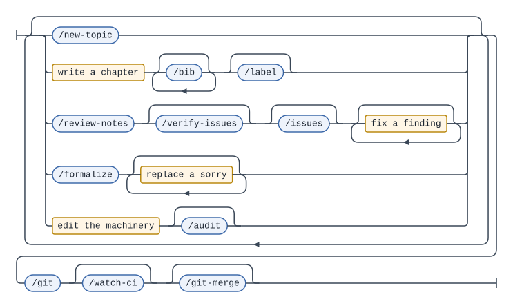

# 数学勉強ノート

このレポの目的は数学のノート作りを軸として, LaTeX, Lean, Git, Claudeやワークフローの構造などを実際に手を動かして学ぶことです。
ノート作りの過程で必要に応じて新しい機能の追加や既存のシステムの修正を行います。

各トピックのPDFは以下から閲覧できます。

<!-- BEGIN PDF LINKS -->
* [代数的K理論](./pdf/algebraic_k_theory.pdf)
* [圏論](./pdf/category_theory.pdf)
* [微分幾何学](./pdf/differential_geometry.pdf)
* [ガロア理論](./pdf/galois_theory.pdf)
* [λ計算](./pdf/lambda_calculus.pdf)
* [多様体論](./pdf/manifold.pdf)
* [シンプレクティック多様体](./pdf/symplectic_manifold.pdf)
* [位相幾何学](./pdf/topology.pdf)
<!-- END PDF LINKS -->

## Three learning tracks

Note-making is the axis; three things are being learned along it. Each track has
its own toolchain, its own gate and its own CI, and none of them can break
another.

| Track | Where | What it is |
| --- | --- | --- |
| LaTeX | `tex/` | One topic per directory — a `main.tex` and its `ch0N.tex` chapters, every one `\input`ing the shared `tex/preamble.tex`. LuaLaTeX builds each into a PDF |
| Lean | `lean/` | A Lake package pinned to a Mathlib release. `Math/Learn/` works through a curriculum; `Math/Study/` mirrors the notes' theorems as statements. `docs/lean-convention.md` owns it |
| Workflow | `scripts/`, `.claude/`, `.github/`, `docs/` | The Python tooling, the slash commands and hooks, the CI, and the conventions they enforce. This track is a subject, not scaffolding — it changes when note-making asks it to |

`Math/Study/` is still empty; the mirrors get written as topics settle enough to
be worth formalising.

The first two halves **share no build dependency, on purpose**: `lake build`
never reads `tex/`, `latexmk` never reads `lean/`, and nothing generates one
from the other. They are joined by a convention — a `\label{}` body and the Lean
declaration formalising it are the same string — and by nothing else.
**`docs/repo-structure.md` is the map**, including the couplings that were
considered and declined; read it before writing anything that joins the two.

## Prerequisites

Nothing here has a lockfile, so this is the list.

| Need | For | Notes |
| --- | --- | --- |
| A TeX Live distribution with LuaLaTeX and `latexmk` | building any PDF | `.latexmkrc` sets `$pdf_mode = 4`, so LuaLaTeX writes the PDF with no DVI step |
| Python 3 | `scripts/` | Standard library only — there is no `requirements.txt` and nothing to install |
| [`elan`](https://github.com/leanprover/elan) | `lean/` | It reads `lean/lean-toolchain` and fetches the pinned `leanprover/lean4:v4.32.2` itself |
| [`gh`](https://cli.github.com/), authenticated | `/review-notes`, `/issues`, `/git-merge`, `/watch-ci` | Findings live as GitHub issues; the local `issues/` worklist is gitignored |

Run `lake --dir=lean exe cache get` before your first `lake --dir=lean build`.
Mathlib is pinned to a release tag rather than `master` precisely so that the
prebuilt cache always hits — without it you compile Mathlib from source, which
takes hours instead of seconds.

## The working loop

A sitting in this repo, as a grammar. Blue boxes are slash commands; amber ones
are the parts no command does for you, which is where the time actually goes.



Read it as: do any amount of work in any order, then land it. The loop repeats
because a chapter is rarely finished in one pass — write, review, fix, write
again — and `/git` is the only way out because CI does not run until something
is pushed.

The grammar is `docs/working-loop.ebnf`, rendered with
[syntax-diagram-generator](https://github.com/ys-math/syntax-diagram-generator).
Edit the grammar, re-render, and commit both.
`scripts/test_agent_docs.py` fails if it names a command that does not exist.

One command is deliberately not on the diagram: `/delete-topic` is an exit
rather than a step, and it is the only command that commits and pushes on its
own.

## Commands
Run everything from the repo root.

| Command | What it does |
| --- | --- |
| `python scripts/new_topic.py <topic> --title <title>` | Creates `tex/<topic>/` with a `main.tex` and a `ch01.tex` holding just its CC BY-NC-ND SPDX header. The slug form is in `docs/naming-convention.md` and the script enforces it; the title is the `\DocTitle`, which becomes the link label in the PDF list above |
| `latexmk -cd -g tex/<topic>/main.tex` | Compiles the topic's PDF locally. `-cd` enters the topic directory so `\input{../preamble.tex}` resolves; `-g` forces a rebuild past latexmk's cache. See `docs/git-strategy.md`, `## Gates` |
| `lake --dir=lean build` | Builds the Lean library in `lean/`. About 3 seconds warm; `sorry` is allowed and does not fail it. See `docs/lean-convention.md` |
| `python -m unittest discover -s scripts -t scripts -p 'test_*.py'` | Tests for `scripts/`; run before committing anything there |
| `python scripts/generate_pdf_links.py`<br>`python scripts/generate_tree.py` | Rewrite the generated README blocks. CI normally does this, so you rarely need to |

Claude Code slash commands:

| Command | What it does |
| --- | --- |
| `/new-topic <topic> <title>` | Creates a topic by running `new_topic.py` above |
| `/delete-topic <topic>` | Deletes a topic — `tex/<topic>/`, `pdf/<topic>.pdf`, its Lean mirror and that mirror's `import`, its open review issues and its local artifacts — then commits and pushes the removal. Renaming is still by hand |
| `/label [topic ...]` | Proposes `\label{}` names for a topic's theorem environments per `docs/label-convention.md`, and applies the ones you pick |
| `/formalize <topic> [label ...]` | Mirrors a topic's labelled theorems into `lean/Math/Study/<Topic>.lean` as Lean statements proved by `sorry`, reusing the label body as the declaration name. It never writes a proof |
| `/review-notes [topic ...]` | Reviews a topic's notes for mathematical correctness, typos and LaTeX health, then files the findings you pick as GitHub issues per `docs/issue-convention.md`. Skips what an open issue already covers; closes nothing |
| `/issues [topic ...]` | Renders a topic's open review issues as `issues/<topic>.md` (gitignored, overwritten on every run) with links that open your working copy at the line |
| `/audit [file ...]` | The same, for the machinery rather than the mathematics: checks the commands, instructions and hooks for contradictions, stale claims and dead steps, writing `.claude/audits/audit.md` (gitignored, overwritten on every run). Then applies the fixes you name — and only those, leaving the commit to `/git` |
| `/git [description]` | Syncs, commits and pushes per `docs/git-strategy.md` |
| `/git-merge [PR number]` | Re-runs a pull request's gates, then squash-merges it |
| `/watch-ci [sha]` | Reports the CI runs for a commit and stops. Built to run under `/loop` |

`docs/agent-system.md` maps the whole setup — these commands, the instruction
files, the hooks that enforce the repo's rules, and how the CI cascade
terminates.

To add a chapter, create `ch02.tex` and add `\input{ch02.tex}` to that topic's
`main.tex` by hand; nothing does this automatically. Copy the
`% SPDX-License-Identifier: CC-BY-NC-ND-4.0` line from `ch01.tex` while you are
there — only the generated `ch01.tex` gets it for free.

To add a Lean file, create it under `lean/Math/` and add its `import` to
`lean/Math.lean` in the same commit; nothing does this automatically either, and
a module nobody imports is invisible to `lake build`. It needs the Apache header
on line 1 — `docs/lean-convention.md` has the text.

Once you push to `main`, CI takes over: `build-pdf.yml` commits
`pdf/<topic>.pdf`, `update-readme.yml` regenerates the PDF list and the
directory tree below, and `lean.yml` builds `lean/` if you touched it. The lists
are generated — edit the `.tex` sources, not them. The tree lists `lean/Math/`
in full, so a new chapter under `Learn/MIL/` or `Learn/TPiL/` shows up in it.

## ディレクトリ構造
<!-- BEGIN TREE -->
```
math-study/
├── docs/
│   ├── images/
│   │   ├── routing-rule.svg
│   │   └── working-loop.svg
│   ├── agent-system.md
│   ├── git-strategy.md
│   ├── issue-convention.md
│   ├── label-convention.md
│   ├── lean-convention.md
│   ├── naming-convention.md
│   ├── repo-structure.md
│   ├── routing-rule.ebnf
│   └── working-loop.ebnf
├── lean/
│   ├── Math/
│   │   └── Learn/
│   │       ├── MIL/
│   │       │   └── C02Basics.lean
│   │       └── TPiL/
│   │           ├── C02DependentTypeTheory.lean
│   │           └── C03PropositionsAndProofs.lean
│   ├── Math.lean
│   ├── lake-manifest.json
│   ├── lakefile.toml
│   └── lean-toolchain
├── scripts/
│   ├── generate_pdf_links.py
│   ├── generate_tree.py
│   ├── latex_unicode.py
│   ├── new_topic.py
│   ├── readme_block.py
│   ├── test_agent_docs.py
│   ├── test_generate_tree.py
│   ├── test_latex_unicode.py
│   └── test_new_topic.py
├── tex/
│   ├── algebraic_k_theory/
│   │   ├── ch01.tex
│   │   └── main.tex
│   ├── category_theory/
│   │   ├── ch01.tex
│   │   └── main.tex
│   ├── differential_geometry/
│   │   ├── ch01.tex
│   │   └── main.tex
│   ├── galois_theory/
│   │   ├── ch01.tex
│   │   └── main.tex
│   ├── lambda_calculus/
│   │   ├── ch01.tex
│   │   ├── ch02.tex
│   │   ├── ch03.tex
│   │   └── main.tex
│   ├── manifold/
│   │   ├── ch01.tex
│   │   └── main.tex
│   ├── symplectic_manifold/
│   │   ├── ch01.tex
│   │   └── main.tex
│   ├── topology/
│   │   ├── ch01.tex
│   │   └── main.tex
│   ├── colophon.tex
│   └── preamble.tex
├── CLAUDE.md
├── LICENSE
├── LICENSE-APACHE-2.0
├── LICENSE-CC-BY-NC-ND-4.0
└── README.md
```
<!-- END TREE -->

## ライセンス
[![MIT][mit-shield]][mit] [![CC BY-NC-ND 4.0][cc-by-nc-nd-shield]][cc-by-nc-nd] [![Apache 2.0][apache-shield]][apache]

This repository is triple-licensed. The table below is authoritative: it matches
on paths, so a file is covered whether or not it carries a header.

| Path | License |
| --- | --- |
| `tex/*/ch*.tex`, `pdf/*.pdf` | [CC BY-NC-ND 4.0][cc-by-nc-nd] |
| `lean/**` | [Apache 2.0][apache] |
| everything else | [MIT][mit] |

The mathematics — the chapter sources and the PDFs built from them — is
[Creative Commons Attribution-NonCommercial-NoDerivs 4.0 International][cc-by-nc-nd].

The Lean library is [Apache 2.0][apache], matching the ecosystem it is written
against: Mathlib, Mathematics in Lean and Theorem Proving in Lean 4 are all
Apache 2.0, and Mathlib requires it of contributions. The CC terms would not
work here anyway — NoDerivs on source nobody may modify is source nobody may
use. Every `.lean` file carries the header, which names
`LICENSE-APACHE-2.0` rather than `LICENSE`, because this repo's `LICENSE` is the
MIT text.

Everything that builds it is MIT: `scripts/`, `.github/`, `.latexmkrc`, and the
shared `tex/preamble.tex`, `tex/colophon.tex` and every `tex/*/main.tex`, which
`new_topic.py` generates. Reuse the build system freely.

Full texts: [`LICENSE`](./LICENSE) (MIT),
[`LICENSE-CC-BY-NC-ND-4.0`](./LICENSE-CC-BY-NC-ND-4.0) and
[`LICENSE-APACHE-2.0`](./LICENSE-APACHE-2.0).

[![CC BY-NC-ND 4.0][cc-by-nc-nd-image]][cc-by-nc-nd]

[mit]: https://opensource.org/licenses/MIT
[mit-shield]: https://img.shields.io/badge/License-MIT-yellow.svg
[apache]: https://www.apache.org/licenses/LICENSE-2.0
[apache-shield]: https://img.shields.io/badge/License-Apache%202.0-blue.svg
[cc-by-nc-nd]: http://creativecommons.org/licenses/by-nc-nd/4.0/
[cc-by-nc-nd-image]: https://licensebuttons.net/l/by-nc-nd/4.0/88x31.png
[cc-by-nc-nd-shield]: https://img.shields.io/badge/License-CC%20BY--NC--ND%204.0-lightgrey.svg
