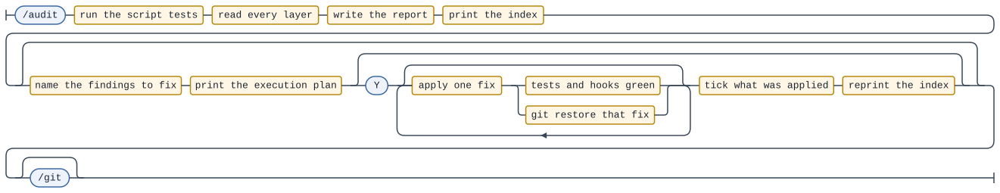
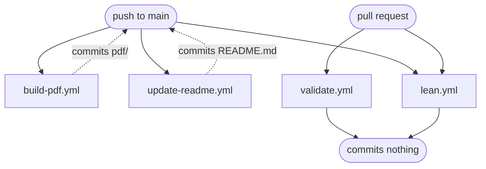

# The agent system

A map of everything in this repo that tells Claude what to do, or stops it doing
something. It exists because that machinery is spread across seven directories
and nothing else shows it in one place.

**This file is a map, not a specification.** It says who owns each rule and where
to change it; it does not restate the rules. Anything written here twice would
drift, which is the failure this repo has already been bitten by — see
`## Where to change things` at the bottom before adding to any of it.

## The four layers

Each layer answers a different question, and they stack rather than compete.

| Layer | Question it answers | Lives in | Binding? |
| --- | --- | --- | --- |
| **Instructions** | What should Claude do, and why? | `CLAUDE.md`, `docs/*.md` | advisory |
| **Commands** | How is this specific job done, step by step? | `.claude/commands/*.md` | advisory, but capability-scoped |
| **Enforcement** | What holds even if Claude ignores the above? | `.claude/settings.json`, `.claude/hooks/` | mechanical |
| **Automation** | What happens with nobody watching? | `.github/workflows/`, `/watch-ci` | mechanical, unattended |

Advisory layers explain; mechanical layers enforce. A rule that matters usually
wants both — `git add -A` is explained in `docs/git-strategy.md`, restated as a
prohibition in `/git`, and made impossible by `.claude/hooks/guard-bash.sh`. The
hook is what stops it; the explanation is what stops Claude looking for a way
around the hook.

## Instructions — who owns what

Loaded on **every** session, so it holds only what cannot be found at the moment
it is needed:

- **`CLAUDE.md`** — the licence boundary, the coupling rules, the generated
  artifacts, and the rule that the mathematics is not Claude's to write. Its own
  preamble states its admission policy; honour it.

Loaded **on demand**, by a command that names them:

- **`docs/git-strategy.md`** — branching, commit format, attribution, gates, and
  the canonical `latexmk` invocation. `/git` and `/git-merge` execute it.
- **`docs/label-convention.md`** — `\label{}` naming. `/label` executes it, and
  it binds any label written by hand too.
- **`docs/bib-convention.md`** — the citation key and the shape of a `\bibitem`,
  in a `thebibliography` written by hand: there is no `.bib` file and no BibTeX.
  `/bib` executes it, and it binds any entry added by hand too. The file's name
  and where `main.tex` `\input`s it belong to `docs/naming-convention.md`.
- **`docs/issue-convention.md`** — what a review finding looks like as a GitHub
  issue: labels, title, body, deduplication, closing. `/review-notes` files
  them, `/git` closes them, `/delete-topic` cleans them up and `/issues` renders
  them locally — four commands, one specification.
- **`docs/naming-convention.md`** — what every file and directory is called, in
  both halves of the repo: topic slugs, chapter files, Lean modules, and what
  else has to move when one of them is renamed. The only naming rule enforced in
  code is the topic slug, in `scripts/new_topic.py`.
- **`docs/lean-convention.md`** — everything under `lean/`: the layout, the
  shared name that joins a Lean declaration to a `\label{}`, the `sorry` rule,
  the Apache header, the Mathlib pin. `/formalize` executes it, and `/label`,
  `/delete-topic` and `/git` each depend on one part of it.
- **`docs/repo-structure.md`** — the companion map: the two halves of the repo,
  the three things that join them, and what deliberately does not. Nothing
  executes it; read it when a change would couple `tex/` and `lean/` more
  tightly than a shared name.
- **`docs/agent-system.md`** — this file.

The grammars in `docs/` specify nothing, being data rather than prose:
**`docs/working-loop.ebnf`**, behind the working-loop diagram in `README.md`;
**`docs/routing-rule.ebnf`**, behind the routing diagram in
`docs/git-strategy.md`; and **`docs/audit-workflow.ebnf`**, behind the diagram
of `/audit`'s two gates under `### Keeping this map true`. Each renders to
`docs/images/<same stem>.svg`.

They are the places a command list appears outside a markdown table, so
`scripts/test_agent_docs.py` reads them directly and fails if one names a
command that `.claude/commands/` does not have. It does the same for the
workflow names inside the ```mermaid block below. Every one of those checks
runs one way — a name that appears must exist, never the reverse — because an
SVG can only be regenerated by hand and the tests gate `update-readme.yml`.

## Commands

They live in `.claude/commands/`. Each one's `description:` and
`argument-hint:` frontmatter is authoritative for *what it does*; the table
below carries only what the frontmatter cannot tell you — **what it is allowed
to touch**, which is what you actually need when choosing between them.

| Command | Writes | Commits | Stops for confirmation | Output |
| --- | --- | --- | --- | --- |
| `/new-topic` | `tex/<topic>/` via the script | no | when proposing a slug | English |
| `/label` | `tex/*/ch*.tex`, `lean/Math/Study/**` | no | always, before applying | English |
| `/bib` | `tex/*/bibliography.tex`, `tex/*/main.tex` | no | always, before writing | **Entries verbatim, English structure** |
| `/formalize` | `lean/Math/Study/**`, `lean/Math.lean` | no | always, before writing | English |
| `/tutor` | **nothing — `disallowed-tools`** | no | to clarify, at most twice | **Japanese mathematics, English structure** |
| `/review-notes` | GitHub issues | no | always, before filing | **Japanese findings, English structure** |
| `/issues` | `issues/**` only | no | no | **Japanese findings, English structure** |
| `/audit` | `.claude/audits/**`, then the files it audits | no | always, before applying a fix | English |
| `/git` | index, commits | yes, pushes | always, before any commit | English |
| `/git-merge` | squash-merges a PR | yes | always | English |
| `/delete-topic` | deletes a topic, closes its issues | **yes, itself** | always | English |
| `/watch-ci` | nothing | no | no | English |

Worth knowing without looking them up:

- **`/delete-topic` commits and pushes on its own**, and is now the one command
  that also *closes* issues. Every other command leaves the working tree
  for `/git`.
- **`/review-notes` never edits `tex/`** — it has no write tool at all, which is
  a stronger boundary than the `Write(reviews/**)` it used to be locked to. It
  files findings as GitHub issues and cannot close one: `gh issue close` is
  absent from its `allowed-tools`, so an undetected finding is reported to the
  user rather than acted on.
- **`/formalize` writes statements and never a proof.** Half of that is a
  declaration: its `allowed-tools` name `lean/Math/Study/**` and the import list
  in `lean/Math.lean`, and nothing else — not `tex/`, not `Math/Learn/**`. That
  is the reach it intends, not a bound on it; the paragraph below this table
  says why. The other half is `guard-edits.sh`, which refuses a write under
  `lean/Math/Study/**` whose tactic blocks are not exactly `sorry` — so this is
  the one command whose central rule is mechanical rather than kept. What stays
  advisory is narrower and worse: never repair an understated statement while
  translating it. See `docs/lean-convention.md`,
  `## What Claude may write here`.
- **`/bib` can leave the test suite red, and that is the design.**
  `scripts/test_new_topic.py` asserts `MAIN_TEMPLATE` reproduces certain topics'
  `main.tex` byte for byte, so wiring a `bibliography.tex` into one of them
  breaks it — which is the guard noticing a topic has grown past the skeleton,
  exactly as its docstring says it should. `/bib` runs the suite, reports the
  failure and stops there: `Edit(scripts/**)` is absent from its
  `allowed-tools`, and clearing the guard is a shared-path change, so it takes a
  branch and a pull request. Without that report the next `/git` fails its gate
  on an error that looks unrelated to adding a reference.
- **`/issues` writes the only local artifact left** — `issues/<topic>.md`,
  gitignored and overwritten, a view of the open issues with links that resolve
  in your working copy. GitHub is the record; regenerate rather than trust it.
- **`/tutor` is the only command that mechanically cannot write.** Its
  `disallowed-tools` removes `Write` and `Edit`, so the rule that the user types
  the mathematics is enforced rather than asked for — the one place in this
  table where that is true of a *command* rather than a hook. It reads `tex/`,
  `lean/`, the topic's open issues and the conventions, runs `latexmk` and
  `lake build` to see real errors, and answers in full. Defects it notices are
  reported and handed to `/review-notes`; `gh issue create` is absent from its
  `allowed-tools` so that `docs/issue-convention.md` keeps one filing channel.
- **`/audit` does edit what it audits**, in a second phase the user has to ask
  for by naming findings from the report. It is the one command whose
  `allowed-tools` reaches `.claude/`, `docs/`, `.github/` and `CLAUDE.md`, so it
  is the one that can break the machinery in this table. What holds is the
  gate, not the capability: it writes the report first, and applies only what
  the report argued for.

Each command's `allowed-tools` line pre-approves those tools for the turn that
invokes it; it does not restrict what else Claude may call, and the grant
clears with your next message. `disallowed-tools` is the field that removes a
tool, and `/tutor` is the only command here that uses one. So every other
command's "cannot" holds only where a hook or a `permissions` rule carries it —
everywhere else it is prose, on the same terms as the rest of this file.

## Enforcement

`.claude/settings.json` wires up two hooks and a permission list.

| Hook | Event | Refuses |
| --- | --- | --- |
| `guard-bash.sh` | `PreToolUse(Bash)` | `git add -A` / `git add .` / `git add ./`; force-push including `--force-with-lease`; `git clean` with no pathspec, unless it is a dry run; `git restore` whose pathspec is `.`, `./` or `:/` |
| `guard-edits.sh` | `PostToolUse(Write\|Edit)` | a `tex/*/ch*.tex` or `tex/*/bibliography.tex` missing its SPDX header; a `lean/**.lean` missing its Apache header; a write under `lean/Math/Study/**` whose tactic blocks are not `sorry`; a `README.md` with a generator marker destroyed |

Permissions additionally deny writes to `pdf/**` and allow about twenty
routine commands through without a prompt.

Two properties to preserve if you touch these:

- **Hooks must be executable.** A non-executable hook fails at invocation, not at
  config load: the setup looks correct and silently does nothing. Both are
  committed mode `100755`.
- **Path-shaped rules belong in `permissions`, everything else in a hook.**
  Permission rules prefix-match, so no rule can catch
  `git push origin main --force`. That single limitation decided which rules went
  where.

### Keeping this map true

Every table in this file enumerates something on disk, and a stale enumeration
reads exactly like a correct one. `scripts/test_agent_docs.py` is what notices:
it holds the command tables here and in `README.md` to `.claude/commands/`, the
hook and workflow and `docs/` names to their directories, the hooks to being
registered and executable, and every count written in digits to what it counts.

It runs wherever the `scripts/` tests already run — `/git`'s gate and the
`update-readme.yml` step — rather than in a checker somebody has to remember to
invoke, which would have the failure mode it is guarding against. So a command
added without a table row fails before the commit exists; if one somehow lands,
the README bot stays red until it is fixed.

Two conventions keep it able to see, and both are load-bearing:

- **Counts go in digits, or go away.** "all 8 topics" is checked. "Seven, in
  `.claude/commands/`" was not, and was wrong within a week — as was "the six
  commands" in `CLAUDE.md`. Where a table already enumerates the things, do not
  also say how many.
- **Enumerations are tables**, keyed on the first column, so prose can name a
  command freely — `/loop` is discussed below and is not a command in this repo.

What no test can check is whether any of this is *true*, only whether the names
line up. `/audit` is the judgment half: it reads for contradictions between
files, claims the repo no longer satisfies, prose that disagrees with an
`allowed-tools` line, steps that cannot fire, procedures with no reachable exit,
and hooks that do not refuse what they claim to. It runs the tests first and
never re-derives what they decide.

It then repairs what you tell it to, which is why the tests are its gate on the
way out as well as in: a fix that renames a command, deletes a document or
changes a count in digits breaks one of the enumerations above, and the run that
made the change is the one that has to notice.



The two optionals nest, and that is the part worth seeing: naming findings from
the index buys an execution plan, and only a literal `Y` against that plan buys
an edit. A run that stops at either gate has still written its report.
`docs/audit-workflow.ebnf` is the source.

## Automation

The workflows in `.github/workflows/`:

| Workflow | Trigger | Does |
| --- | --- | --- |
| `build-pdf.yml` | push to `main` touching `**.tex`, `.latexmkrc` | compiles affected topics, commits `pdf/*.pdf` |
| `update-readme.yml` | **every** push to `main` | runs the script tests, regenerates the README blocks, commits |
| `validate.yml` | `pull_request` | compiles all 8 topics, runs the script tests |
| `lean.yml` | push to `main` **and** `pull_request`, both touching `lean/**` | builds the Lean library through `lake` |

Measured run times live in `.claude/commands/watch-ci.md`, which is the only
thing that needs them — they set its polling interval. `/watch-ci` reads them
but has no write tool, so nothing updates that table on its own: re-measure it
by hand whenever the build changes.

`validate.yml` runs only on pull requests, and `tex/<topic>/**` never goes
through one — which is why the licence header is enforced by a hook instead. The
same holds for `lean/Math/**`, and `lean.yml` does not rescue it: the workflow
runs on the push, so it sees a missing Apache header only after the commit
exists. Hence the second rule in `guard-edits.sh`.

`lean.yml` is the one workflow with both triggers, because `lean/` is the one
place a source path and its build configuration take different routes to `main`.

### Why the push cascade terminates



The dotted edges are the feedback loops. Two of the workflows push to `main`,
so both could retrigger CI forever. They don't, by two different mechanisms,
and both are worth preserving:

- **`build-pdf.yml` writes what it does not watch.** It commits `pdf/*.pdf`,
  which matches neither of its path filters. It cannot trigger itself.
- **`update-readme.yml` converges.** It has no path filter, so it *does* trigger
  itself — but its output is a pure function of `git ls-files`, so the second run
  produces identical bytes, `git diff --cached --quiet` succeeds, and it commits
  nothing. The cascade dies at the fixed point.

Both also retry a rebase three times, because the fast workflow pushes while the
slow one is still in TeX Live.

`validate.yml` and `lean.yml` commit nothing at all, so neither can enter the
cascade in the first place.

`/watch-ci` reports the result and stops; it is built to run under `/loop` and
ends every run with a `watch-ci: done|pending|unknown` line for a loop to read.

## Where to change things

The routing question, in the order worth asking it:

1. **Does it need to hold even when Claude is not cooperating?** → a hook in
   `.claude/hooks/`, or a `permissions` rule if it is purely path-shaped.
2. **Is it one job with steps?** → a command in `.claude/commands/`.
3. **Is it a rule several commands share?** → `docs/`, named as the single copy,
   with each command pointing at it and *not* restating it.
4. **Would Claude go wrong without knowing it exists, in any session?** → and
   only then, `CLAUDE.md`.

Most things belong at 2 or 3. `CLAUDE.md` is the expensive tier — it is paid on
every session, including the ones it is irrelevant to.

Whatever you add, add it to the tables above in the same commit — see
`### Keeping this map true`. A map that is a commit behind is worse than no
map, because it is still believed.

When a fact ends up in more than one file, name one owner and make the others
point at it. This repo once carried three different spellings of the local
`latexmk` command across six files, and the authoritative one was wrong about
its own flags; nobody was careless, and nothing caught it, because no file
claimed to be the copy.
