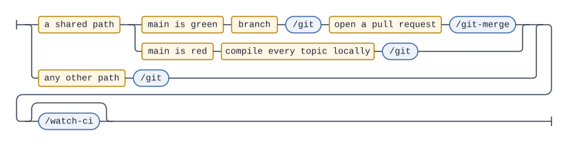

# Git strategy

This repo is one person's mathematics notes plus the Python and CI that build
them. There is no release train, no reviewer, and no second contributor, so the
strategy optimises for the two things that actually bite here:

- **A shared file breaks eight documents at once.** `tex/preamble.tex` is
  `\input` by every topic; a missing `\usepackage` in it fails all of them, and
  the failure surfaces minutes later in CI rather than on your screen.
- **CI writes to the branch you work on.** Every push to `main` triggers
  `build-pdf.yml`, which commits `chore(ci): update compiled PDFs` back to
  `main`; `update-readme.yml` may add a second commit. Your local `main` is
  behind after every push.

Everything below follows from those two facts. The day-to-day version is the
`/git` command, which implements this document; read on when you want the
reasoning, or when you are committing by hand.

## The shape

`main` is the only long-lived branch. There is no `develop` and no draft
branch: every commit on `main` is published within minutes, and that is the
intent — the notes are written to be read, not staged for a release.

Branches are short-lived, single-purpose, and exist for exactly one reason: to
keep a change that can break every topic away from `main` until it is proven.

There are three routes to `main`, and the shape of the choice is the same every
time:



The diagram is the shape; the table below is the lookup. It stays that way on
purpose — which paths count as shared changes whenever a new shared file
appears, and a picture that enumerated them would go stale in a way nothing
could see. The three routes do not change. The grammar is
`docs/routing-rule.ebnf`.

| Path | Where it goes | Why |
| --- | --- | --- |
| `tex/<topic>/**` | straight to `main` | Blast radius is one document. |
| `lean/Math/**` | straight to `main` | Blast radius is one module. |
| `README.md`, `CLAUDE.md`, `docs/**` | straight to `main` | Prose; nothing compiles it. |
| `.claude/**` | straight to `main` | Changes how Claude behaves, not what builds. |
| `scripts/**` | branch + PR | A break here silently stops the README from regenerating. |
| `.github/**` | branch + PR | A break here is only observable on `main`. |
| `.latexmkrc` | branch + PR | Build configuration for every topic. |
| `tex/preamble.tex` | branch + PR | `\input` by all 8 topics. |
| `tex/colophon.tex` | branch + PR | `\input` by all 8 topics. |
| `lean/lakefile.toml`, `lean/lean-toolchain`, `lean/lake-manifest.json` | branch + PR | A bad Mathlib bump breaks every proof at once. |
| everything else | straight to `main` | Blast radius is nothing that builds. |

The rule is a lookup, not a judgment call. That is deliberate: `/git` evaluates
it from `git status --porcelain`, and a rule phrased as "use judgment about the
blast radius" would be decided differently on different days.

Note what the table does *not* say. A change touching seven topics' `ch01.tex`
still goes straight to `main` — seven independent documents, seven independent
failures, each trivially revertable. Blast radius is about *coupling*, not file
count.

### Mixed changes

When one working tree holds both kinds, the content part is committed to `main`
first with a path-scoped `git add`, then the shared remainder moves to a
branch. When the two halves are genuinely one change — a new preamble macro and
the chapter that first uses it — keeping them together on the branch is better;
say so when `/git` shows you the plan.

### Hotfix clause

**When `main` is red, a shared-file fix goes directly to `main`,** skipping the
branch — but only after compiling all 8 topics locally. A full local compile
takes about 12 seconds; waiting for a PR round trip while the published PDFs
rot does not pay for itself.

This is the one exception, and it is narrow: `main` must already be failing.
"I am confident this is fine" is not a hotfix.

## Branch naming

`<type>/<kebab-slug>`, where `<type>` is a commit type from the list below:

```
feat/git-strategy      ci/pr-validation      fix/readme-marker-parsing
```

This matches the branches already in the history (`feat/new-topic-script`).
Branches are deleted on merge, by `gh pr merge --delete-branch`.

## Commits

Conventional commits, in English, imperative mood, subject ≤ 72 characters and
no trailing period:

```
<type>(<scope>): <subject>
```

**Types** — `feat`, `fix`, `docs`, `ci`, `refactor`, `chore`, `test`. The
history also contains `remove:`; do not continue it, use `chore:` or
`refactor:`.

**Scope** — the topic directory name for content changes
(`feat(algebraic_k_theory): add a definition for projective modules`), the
shared file's stem for shared `.tex` (`fix(preamble): load thmtools for
\declaretheorem`), and omitted otherwise (`ci: build PDFs only for topics whose
sources changed`).

**Body** — only when the subject cannot carry the *why*. A body that restates
the diff is noise; a body explaining why a workaround exists is the reason the
commit is worth reading in a year.

**Trailers** — `Closes #N` for a review finding this commit fixes, then
`Co-Authored-By` where it applies. Both go at the end, one per line, after a
blank line.

### Closing review issues

`/review-notes` files its findings as GitHub issues, and the commit that fixes
one is what closes it:

```
fix(galois_theory): 補題 1.2 の証明を埋める

Closes #12
```

`main` is where content commits land, so the trailer takes effect on the push.
On a branch it does nothing until the PR merges — correct, and no special case.

`/git` proposes the trailer by matching the topic's open issues against the
diff, and shows it in the plan you confirm; it never adds one you have not seen.
`docs/issue-convention.md` owns the rest, including what an issue looks like and
why nothing closes one automatically at review time.

### Granularity

One commit per (topic, type). A change spanning `manifold` and `topology` is
two commits; a new definition and an unrelated typo fix in the same file are
one commit, because splitting inside a file means staging hunks and that is
not worth the fragility.

Granularity therefore comes from committing *often*, exactly as this history
already does — `add a definition for projective modules` and `add a
characterization of projective modules and its proof` are separate commits in
the same file. Run `/git` after each mathematical unit and the log keeps that
shape for free.

### Attribution

`Co-Authored-By: Claude Opus 5 <noreply@anthropic.com>` — the model name being
whichever model made the commit — goes on commits Claude actually authored — `scripts/`, `.github/`, `docs/`, `.claude/`, the shared
build files `tex/preamble.tex` and `tex/colophon.tex`, and `lean/`'s build
configuration.

It never goes on `tex/<topic>/**` or `lean/Math/**`. The mathematics is the repo owner's, and
`/git` frequently commits prose that Claude only transported. A trailer there
would be false.

## Syncing

```bash
git config pull.rebase true
git config rebase.autoStash true
```

Then `git pull` before you commit, always — or let `/git` do it, which it does
unconditionally as its first step.

**The rebase can never conflict.** CI only ever writes `pdf/*.pdf` and the two
marker-delimited blocks in `README.md`, and neither is hand-edited. So the
sync is pure ceremony, which is precisely why it should be automated rather
than remembered.

Note that `--autostash` restores your changes **unstaged**. If you had a
partial `git add` in progress, the staging is lost even though the content is
not.

## Merging

Squash, always, via `/git-merge` or:

```bash
gh pr merge --squash --delete-branch
```

`main` stays linear: one commit per merged branch, no merge bubbles, and
`git log --oneline` reads as a list of changes rather than a graph. The single
merge commit in the history (`8f4fa4d`, PR #2) predates this rule.

Merging from the CLI also keeps the author identity consistent. That merge
commit is attributed to `Yuto Sasaki` rather than `yuto` — same email, but
GitHub's web UI stamps the profile display name. `gh pr merge` uses your local
identity.

## Never

- **Force-push anything.** Not `--force`, not `--force-with-lease`.
- **Rewrite pushed history** — no `commit --amend`, no rebase of a branch that
  has an open PR. A bad message on `main` is fixed by a follow-up commit, not
  by rewriting.
- **`git add -A` or `git add .`** Path-scoped adds only. The working tree may
  hold someone else's in-progress work, and a blanket add ships it.
- **Hand-edit generated artifacts.** `pdf/*.pdf` and the `<!-- BEGIN … -->`
  blocks in `README.md` belong to CI; change the `.tex` sources instead.
- **Merge a PR without reading it.** `/git-merge` stops for confirmation for
  this reason.

## CI's own commits

Two workflows push to `main`:

- `build-pdf.yml` → `chore(ci): update compiled PDFs`
- `update-readme.yml` → `docs: update generated README sections`

Both conform to the convention above, so `git log --oneline` is uniformly
scannable even though you wrote none of them.

They cannot be merged into a single commit: `build-pdf.yml` is path-filtered to
`**.tex` and `.latexmkrc`, while `update-readme.yml` runs on *every* push.
Merging them would mean either running TeX Live on every push, or losing tree
updates on commits that touch no `.tex` file — such as the one that added this
document.

The other two commit nothing, so they stay out of that entirely. `validate.yml`
runs on `pull_request`: it compiles all 8 topics and runs the script tests. It
exists because branches are reserved for exactly the changes that can break
every topic, and before it those changes were the only ones with no CI at all.
`lean.yml` runs on both a push to `main` and a pull request, filtered to
`lean/**` — Lean is the only half of the repo whose sources go straight to
`main` while its build configuration goes through a branch, so it is the only
one that needs watching on both paths.

## The commands

| Command | Does | Cannot |
| --- | --- | --- |
| `/git` | sync, gate, propose a plan, then commit, push, open a PR | merge |
| `/git-merge` | inspect a PR, re-run the gates, then squash-merge and clean up | commit new work |

The split is a rule these two commands keep, not something the frontmatter
enforces: `docs/agent-system.md` `## Commands` says what an `allowed-tools`
line does and does not do. This mirrors `/review-notes`, which carries no
write tool at all and no `gh issue close`, so it can neither edit the notes
it reviews nor decide a finding is fixed.

Both stop for confirmation before doing anything irreversible. Both run the
gates *before* a commit exists, so a failure leaves nothing to undo.

## Gates

Before any commit, the relevant checks run locally:

| Changed | Gate | Cost |
| --- | --- | --- |
| `tex/<topic>/**` | compile that topic | ~1.5 s |
| `tex/preamble.tex`, `tex/colophon.tex`, `.latexmkrc` | compile all 8 topics | ~12 s |
| `scripts/**`, `.claude/**`, `docs/**`, `README.md` | `python -m unittest discover -s scripts -t scripts -p 'test_*.py'` | ~1 s |
| `lean/**` | build the Lean library | ~3 s warm |

The documentation paths run the tests too, because `scripts/test_agent_docs.py`
is one of them: it holds the command tables in `README.md` and
`docs/agent-system.md` to what is actually in `.claude/commands/`, and every
count written in digits — "all 8 topics", above — to what it counts.
**This is the authoritative spelling of that invocation**, on the same terms as
the two below: `CLAUDE.md`, `README.md`, `/git`, `/git-merge` and `/audit` print
it verbatim and change with it, and `validate.yml` and `update-readme.yml` hold
the literal string because they execute it.

```bash
latexmk -cd -g tex/<topic>/main.tex
```

**This is the authoritative spelling of that invocation.** `CLAUDE.md`,
`README.md`, `docs/label-convention.md`, `/git`, `/label` and
`/review-notes` each print it too, where a command has to run it; every one of
those is a verbatim copy of this line and changes with it. Change this line
without them and the repo is back to running three different recipes for one
operation, which is how it ended up here.

`-cd` enters the topic directory so `\input{../preamble.tex}` resolves; `-g`
forces a rebuild, which matters because latexmk caches a previous failure and
will otherwise report "Nothing to do" on a file that does not compile. The
`.latexmkrc` at the repo root is picked up automatically from the working
directory. Passing `-r .latexmkrc` as well does *not* read it twice — latexmk
recognises the repeat and skips it — but it does print

```
Latexmk: A user -r option asked me to process an rc file an extra time.
   Name of file = '.latexmkrc'
   Abs. path = '/…/math-study/.latexmkrc'
  I'll not process it
```

at the top of the run. Harmless, but it is noise in the one place a gate is
supposed to be reading carefully, so leave `-r` off.

Aux files and `main.pdf` are gitignored; leave them, and do not run
`latexmk -c`. The next build reuses them.

```bash
cd lean && lake build
```

**This is the authoritative spelling of that invocation**, on the same terms as
the one above; `CLAUDE.md` and `README.md` print it verbatim and change with it,
while `docs/lean-convention.md` and `/formalize` point here rather than
restating it.

**It is `cd lean`, not `lake --dir=lean`, and the difference is not cosmetic.**
`--dir` tells Lake where the package is, but `lake` and `lean` are elan shims,
and **elan chooses the toolchain from the working directory** — it looks for a
`lean-toolchain` there and in its ancestors, never at `--dir`. The repo root has
no `lean-toolchain`, so from the root elan falls back to its default `stable`
and compiles the revisions pinned in `lake-manifest.json` with whatever Lean is
current. That is not hypothetical: it is why `lake --dir=lean build` failed here
with ten errors inside Batteries, Qq, ProofWidgets and Mathlib core, none of
them anything to do with the file being gated, while `cd lean` — which puts
`lean/lean-toolchain` on the search path — built the same tree green.

So a failure in this gate that names an upstream package is the toolchain, not
your proof. Check `lean --version` from inside `lean/` against
`lean/lean-toolchain` before believing it.

`lean.yml` is immune and needs no equivalent fix: `lean-action` takes
`lake-package-directory: lean` and installs the toolchain named there, and a
fresh runner has no stray default to fall back to. This is a local-gate problem
only.

There is no `-g` equivalent and none is wanted — Lean's incremental build is
trustworthy, which is what keeps this gate at three seconds instead of an hour.

The build is green with `sorry` in it, deliberately; `docs/lean-convention.md`
owns that rule and the rest of what lives under `lean/`. `lean/.lake/` is
gitignored and holds Mathlib — several gigabytes. Leave it, exactly as with the
aux files: `lake clean` costs an afternoon to undo.

### The local gate is necessary, not sufficient

CI compiles in `ghcr.io/xu-cheng/texlive-alpine:latest` — **TeX Live 2026**,
LaTeX2e 2026-06-01. A local install is whatever you last updated to. A preamble
can compile cleanly on one and fail on the other, and this has already happened
here: `\declaretheorem` with `sibling=` compiles under TeX Live 2025 and raises
`Command \c@proposition already defined` under 2026.

So a green local compile means "I did not break it in an obvious way", not "CI
will pass". For `tex/preamble.tex`, `tex/colophon.tex` and `.latexmkrc`, the
authoritative check is `validate.yml` on the PR — which is the strongest
argument for those files being branch-only in the first place.

## Setup on a new clone

```bash
git config pull.rebase true
git config rebase.autoStash true
```

Nothing else. There are no hooks and no branch protection: the commands are the
enforcement on the agent path, and this document is the reference for the rest.

Branch protection was considered and rejected on the merits — requiring status
checks on `main` would block the direct pushes that content commits depend on.
